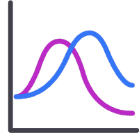

# Luminosity Drone

## Overview
This project involves the development of an autonomous drone equipped with various functionalities including PID control, LED detection, path planning, data transmission, and safe landing mechanisms.

## Team Details

- **Team ID:** 3114
- **Team Members:**
  - Aman Raj
  - Pratyush Roshan Mallik
  - Gaurav Kumar Sharma
  - Chandan Priyadarshi

## Tools

| OS | Language | Frameworks | Visualizer | 
| ---- | ---- | ---- | ---- |
|  |  |  |  |

## Submission

<!--
## Project Structure

- **Task 1**
  - [Position Hold](https://github.com/amanRaj7/eYantra23/blob/main/task_1/position_hold.py)
  - [Led Detection](https://github.com/amanRaj7/eYantra23/blob/main/task_1/led_detection.py)

- **Task 2**
  - [Life Form Detection](https://github.com/amanRaj7/eYantra23/blob/main/task_2/LD_3114_life_form_detector.py)
  - [Waypoint Navigation](https://github.com/amanRaj7/eYantra23/blob/main/task_2/waypoint_navigation.py)
-->
